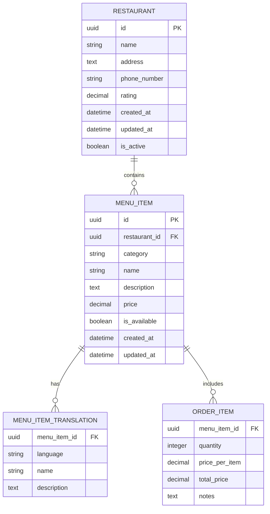

# Backend - Restaurant Management System

This is the backend component of the VSKY Fullstack Demo, a comprehensive restaurant management system built with Django and Django REST Framework. It provides RESTful APIs for managing restaurants, menu items, orders, and real-time features using gRPC and MQTT. The system includes data processing capabilities for revenue calculation and integrates with PostgreSQL for data persistence and Redis for caching.

## Features

- **Restaurant Management**: Create, read, update, and delete restaurant details.
- **Menu Items**: Manage menu items with translations and imports.
- **Order Processing**: Handle orders with real-time MQTT messaging.
- **Revenue Calculation**: Compute total revenue from order data using Python functions.
- **Real-time Communication**: gRPC server for restaurant services and MQTT subscriber for order updates.
- **Caching**: Integrated Redis for performance optimization.
- **API Documentation**: RESTful endpoints with Django REST Framework.

## Database Schema

The system uses PostgreSQL as the primary database and includes the following main entities:




### Restaurant
Core restaurant information and management.
- **id**: UUID (Primary Key)
- **name**: Restaurant name (indexed)
- **address**: Full address details
- **phone_number**: Contact phone number
- **rating**: Restaurant rating (0.0-5.0 scale)
- **created_at**: Record creation timestamp
- **updated_at**: Last update timestamp
- **is_active**: Active status flag

### MenuItem
Individual menu items offered by restaurants.
- **id**: UUID (Primary Key)
- **restaurant**: Foreign Key to Restaurant
- **category**: Menu category (indexed)
- **name**: Item name (indexed)
- **description**: Item description
- **price**: Item price (decimal)
- **is_available**: Availability status
- **created_at**: Record creation timestamp
- **updated_at**: Last update timestamp

### MenuItemTranslation
Multilingual support for menu items (English, Spanish, French, German, Chinese, Arabic, Hindi).
- **menu_item**: Foreign Key to MenuItem
- **language**: Language code
- **name**: Translated name
- **description**: Translated description

### OrderItem
Individual items within customer orders.
- **menu_item**: Foreign Key to MenuItem
- **quantity**: Number of items ordered
- **price_per_item**: Price at time of order
- **total_price**: Calculated total (quantity × price_per_item)
- **notes**: Special instructions or customizations

## Technologies Used

- **Framework**: Django 5.2.7, Django REST Framework 3.16.1
- **Database**: PostgreSQL (with psycopg2-binary)
- **Caching**: Redis (with django-redis)
- **Real-time**: gRPC (grpcio), MQTT (paho-mqtt)
- **Data Processing**: Pandas, NumPy, OpenPyXL
- **Other**: CORS handling (django-cors-headers), Character encoding (chardet)

## Project Structure

```
backend/
├── apps/                  # Django apps directory
├── common/                # Shared utilities and database checks
├── manage.py              # Django management script
├── mysite/                # Main Django project settings
│   ├── settings.py        # Project configurations
│   ├── urls.py            # Root URL configuration
│   └── ...
├── orders/                # Orders app (models, views, serializers)
├── restaurant_app/        # Restaurant management app
├── menu_items/            # Menu items app
├── menu_imports/          # Menu import utilities
├── grpc_server.py         # gRPC server for restaurant services
├── mqtt_subscriber.py     # MQTT subscriber for orders
├── mqtt_restaurant_orders.py  # MQTT for restaurant orders
├── random_order_generator.py  # Script for generating sample orders
├── requirements.txt       # Python dependencies
├── Dockerfile             # Docker configuration
└── README.md              # This file
```

## Installation and Setup

### Prerequisites
- Python 3.9 or higher
- PostgreSQL database
- Redis server (for caching)
- Virtual environment (recommended)

### Local Setup

1. **Clone the Repository**:
   ```bash
   git clone <repository-url>
   cd vsky_fullstack-demo/backend
   ```

2. **Set Up Virtual Environment**:
   ```bash
   python -m venv venv
   source venv/bin/activate  # On Windows: venv\Scripts\activate
   ```

3. **Install Dependencies**:
   ```bash
   pip install -r requirements.txt
   ```

4. **Configure Database**:
   - Ensure PostgreSQL is running and create a database (e.g., `demo_db`).
   - Update `mysite/settings.py` with your database credentials:
     ```python
     DATABASES = {
         'default': {
             'ENGINE': 'django.db.backends.postgresql',
             'NAME': 'your_db_name',
             'USER': 'your_db_user',
             'PASSWORD': 'your_db_password',
             'HOST': 'localhost',
             'PORT': '5432',
         }
     }
     ```
   - Also configure Redis in `settings.py`:
     ```python
     CACHES = {
         'default': {
             'BACKEND': 'django_redis.cache.RedisCache',
             'LOCATION': 'redis://127.0.0.1:6379/1',
             'OPTIONS': {
                 'CLIENT_CLASS': 'django_redis.client.DefaultClient',
             }
         }
     }
     ```

5. **Run Migrations**:
   ```bash
   python manage.py migrate
   ```

6. **Create Superuser** (Optional):
   ```bash
   python manage.py createsuperuser
   ```

7. **Run the Development Server**:
   ```bash
   python manage.py runserver 7001
   ```
   The server will start at `http://127.0.0.1:7001/`.

### Using Docker

1. **Build the Docker Image**:
   ```bash
   docker build -t backend .
   ```

2. **Run the Container**:
   ```bash
   docker run -p 7001:7001 backend
   ```
   Ensure external services (PostgreSQL, Redis) are accessible or use Docker Compose for orchestration.

## Usage

### Running the Server
- **Local**: `python manage.py runserver 7001`
- **Docker**: As above.

### API Endpoints
- **Restaurants**: `/restaurants/` (CRUD operations)
- **Menu Items**: `/menu-items/` (with translation support)
- **Orders**: `/orders/` (for order management)

Access the Django admin at `http://127.0.0.1:7001/admin/` for management interfaces.

### Additional Scripts
- **gRPC Server**: Run `python grpc_server.py` for gRPC services.
- **MQTT Subscriber**: Run `python mqtt_subscriber.py` for real-time order updates.
- **Revenue Calculator**: Use functions in `orders/revenue_calculator.py` for data processing.

## Testing

Run tests with:
```bash
python manage.py test
```

## Contributing

1. Fork the repository.
2. Create a feature branch.
3. Make your changes.
4. Run tests.
5. Submit a pull request.

## License

This project is for demonstration purposes. Refer to the main repository for licensing information.